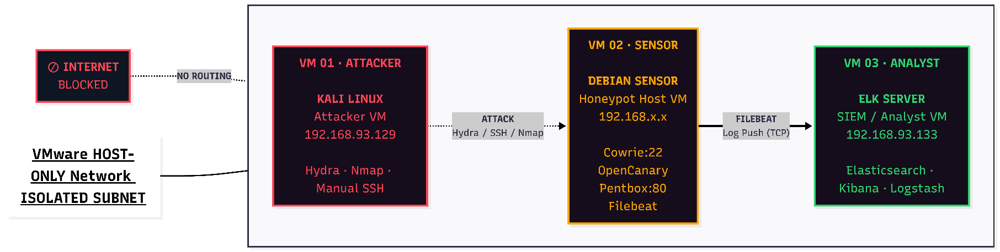

# ELK-Powered-Deception-Lab-Honeypot-Systems
Proactive cybersecurity lab deploying Cowrie and OpenCanary honeypots with an ELK Stack (Elasticsearch, Logstash, Kibana) pipeline. Captures attacker telemetry in an isolated virtual environment while ensuring forensic integrity and GDPR-compliant data minimization.

# ELK To Analysis Honeypot Systems
## Problem Statement
Every day the digital world is getting more dangerous, and standard defenses are struggling to keep up against these attacks. Most organizations rely on firewalls or antivirus software, but these are 'reactive' tools. They only start working once the threat is already inside the system. This delay is incredibly expensive. According to the IBM Cost of a Data Breach Report (Cost of a Data Breach Report 2024), the average cost of a breach has now hit a staggering $4.88 million.  

## Aims and Objectives
**The aim of this project** is to design, deploy, and evaluate a controlled honeypot architecture inside a secure virtual network which can capture and analyze the behavior of the attacker. The goal is to deploy a deceptive system which resembles a legitimate service to lure in the hackers. 

## Deception Architecture
**Designing** a honeypot is a 'Psychological Engineering' exercise in which if the trap looks too easy to the attacker, then the intruders will be suspicious about it and if it is too hard, it is possible that they might leave it. Therefore, a Multi-Layered Architecture has been designed to solve this problem.

## Results
**Total Login Attempts:** 18,221 captured.
**Unique Combinations:** 4,112 unique username/password pairs recorded.
* **Visibility:** The medium-interaction layer captured specific post-compromise behaviors (e.g., `wget`, `whoami`) that low-interaction sensors missed.

## Conclusion
  
The project successfully met its primary objective which was the creation of a forensic-ready, medium-interaction honeypot system integrated with a real-time SIEM. By moving data instantly from the 'Sensor' (Debian) to the 'Storage' (Elasticsearch). This system had achieved a level of forensic integrity that remained resilient even in the event of deletion of local logs. This architecture serves as a blueprint for proactive network defence in an increasingly hostile threat landscape. 
